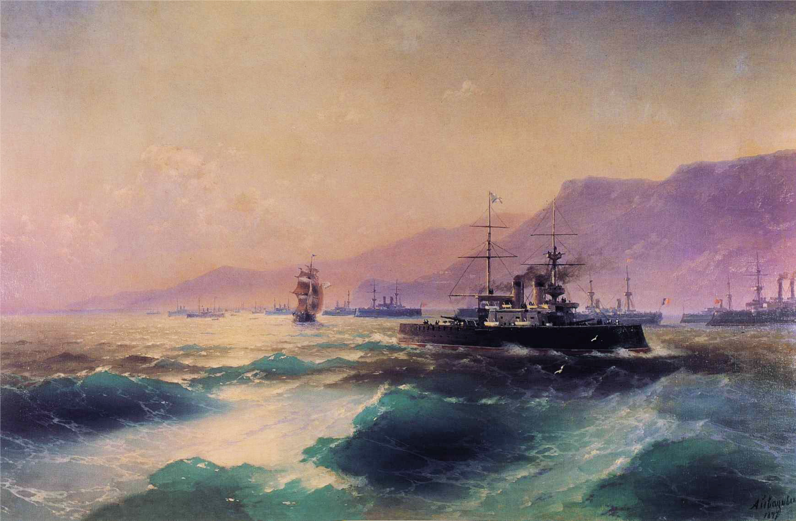
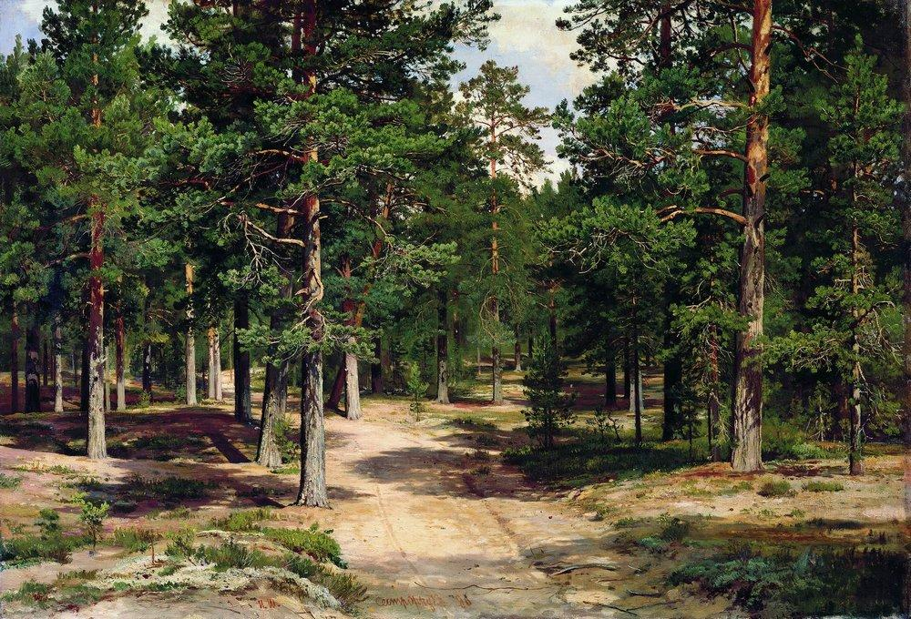
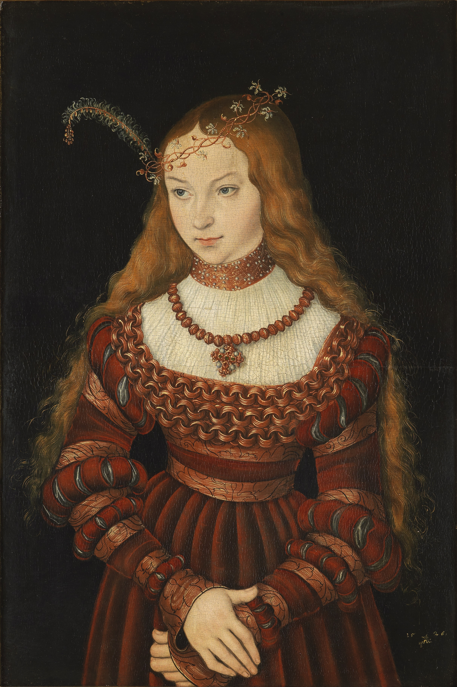
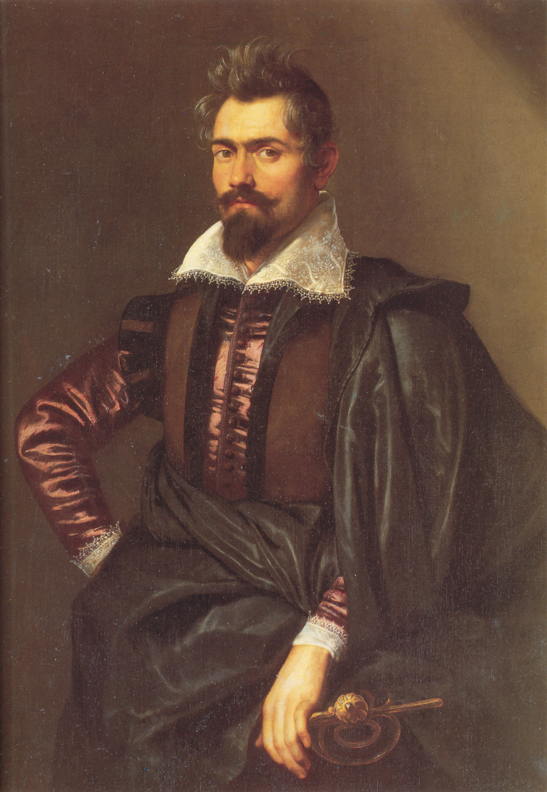

# **Unstructured Data course**

## **Art Classifier**

This project was undertaken as part of the Unstructured Data course within the Big Data Master's Degree program at Comillas ICAI University. The GitHub repo created for this project can be found [here](https://github.com/jorge-ayuso/art-classifier).

The team responsible for the project includes:

|Name                    |Email                              |
|------------------------|-----------------------------------|
|Jorge Ayuso Martínez    |jorgeayusomartinez@alu.comillas.edu|
|Carlota Monedero Herranz|carlotamoh@alu.comillas.edu        |
|José Manuel Vega Gradit |josemanuel.vega@alu.comillas.edu   |

The primary objective of this project is to construct an Art Classifier using Deep Learning techniques. We employed data from the [WikiArt](https://www.wikiart.org/) project and used a dataset available on [Kaggle](https://www.kaggle.com/datasets/sivarazadi/wikiart-art-movementsstyles), which was customized for building Deep Learning models that can classify various art styles. 

Due to practical and storage limitations, we will only be classifying four of the numerous available movement styles: Romanticism, Realism, Renaissance, and Baroque:

- #### Romanticism

    

- #### Realism

    

- #### Renaissance

    

- #### Baroque

    

To ensure a balanced dataset, we cropped the original dataset to 5,000 images for each of the four styles. This will enable us to achieve a more reasonable training time while still allowing for effective model training and assessment. The final dataset used can be found [here](https://drive.google.com/drive/folders/1rEL2TdfIUkHX49IKhB6mx746CR0quYPM?usp=share_link). The validation and test sets are stored in their corresponding .zip files, whereas the training set is stored in the `train` folder, which contains for .zip files, one for each of the four styles previously mentioned.

## Overview

Our project begins with the creation of a basic CNN architecture from scratch, which will serve as our base model. However, we encounter a major issue with this network: significant overfitting to the training data. To address this issue, we take an incremental approach and build on top of the initial architecture using various techniques, including dropout, batch normalization, and data augmentation.

After exploring our custom-built model, we shift our focus to transfer learning and examine two different philosophies: feature extraction and fine-tuning.

1. For feature extraction, we use a pre-trained model as a fixed feature extractor, and the extracted features serve as input for training a classifier on the new task
2. For fine-tuning, we unfreeze the last few layers of the convolutional part and retrain them along with the classifier.

To accomplish this, we evaluate three models:

+ ResNet50
+ VGG16 & VGG19
+ MobileNet

Finally, we explore a different network architecture using Huggingface's Transformers. 

Throughout the project, we monitor accuracy and loss plotted across epochs for each model, ensuring that we interpret the results correctly and draw actionable insights.